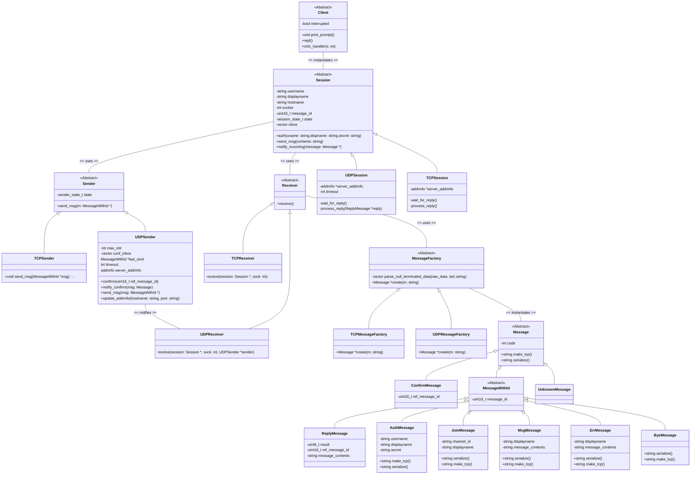

# IPK-Project-1

## Introduction

The client for **IPK-CHAT**[IPK-CHAT] connects to the server via the specified protocol and allows the user to authenticate, send and receive messages and to join channels.

### Theory

The **IPK-CHAT** protocol specifies the behaviour of chat server and client
in order to allow two-way communication for exchange of user messages and metadata.
The chat protocol has two variants: over UDP and over TCP, both of which are implemented in
this project.

#### TCP

**Transmission Control Protocol** (TCP) is used as reliable transport
(OSI Layer 4) protocol for communication between hosts in packet-switched computer networks. 
The communication takes form of an in-order byte-stream, which can be sent by either party
to the other one. A variety of means is used for reliable transmission, including sequence
numbers, which are assigned to each **segment** to ensure in-order delivery; and
an acknowledgement mechanism - the receiver acknowledges the receipt of a segment to the
sender.[RFC9293]

Even though the protocol provides reliable and in-order data transfer, it does not
possess a mechanism for separating discrete blocks of data - it only provides a byte-stream
without any separation, which makes it imperative to implement a sort of data separation
mechanism.

#### UDP

**User Datagram Protocol** (UDP) is also a transport (OSI Layer 4) protocol designed for
packet-switched computer communication, whose function, nevertheless, carries significant
differences to such of TCP. Generally speaking, the protocol can be called simpler
than TCP, with its absence of reliability-ensuring and order-securing mechanisms.
Its *protocol data unit* (PDU) is called a **datagram** and it does not contain 
a sequence number to establish the order of datagrams; 
nor is the receiving party obliged to send an acknowledgement upon 
receiving a piece of data. 
The protocol does, however, deliver data as a sequence of datagrams, 
rather than a homogenous byte-stream.[RFC768]

The specifics of this protocol beg for an implemetation of some sort of an acknowledgement
mechanism. The design complexity, nevertheless, is alleviated to a certain degree by the
the presence of a data separation mechanism in the form of datagrams.

#### BSD Sockets

**Sockets** are structures that act as communication endpoints for bidirectional data
exchange between processes, which are used in this project to interact with the remote
server over a network. They are identified by a file descriptor which is used to interact
with the socket using appropriate function calls. In this regard they are similar to 
*pipes*, with the latter being less flexible, albeit simpler.

A socket can handle either a stream of data or datagrams, depending on the socket type.
Stream sockets are usually used for TCP, while datagram sockets are used for UDP
communication. Depending on whether a connection is established using the connect() call,
communication can be connection-oriented or connectionless. connect() can also be called
on a datagram socket, which merely lets the programmer supply the information about the
counterpart to the socket in advance.

### Requirements

#### Client

- make
- gcc

#### Tests

- googletest

## Usage

### Command line arguments

The two required arguments are HOSTNAME and PROTOCOL. The user can also specify the port (**-p**, default is 4567), UDP confirmation timeout in milliseconds (**-d**, default is 250), and the maximum number of UDP retransmissions (**-r**, default is 3). 

UDP-related options will be ignored when -t tcp is specified. **-h** shows a help message and exits.

### Commands

Commands are identified by the "/" in the beginning. The following commands are available:

- **/auth** *{username}* *{secret}* *{display_name}* - Attempt to authenticate at the remote server. The value in the DISPLAY_NAME option will be shown to all the other users when a user sends a message to a channel. If the authentication is successful, there will be a *Success: {message}* message and the user will be allowed to send messages to the channel. Otherwise, a *Failure: {message}* will appear.
- **/join** *{channel_id}* - Join the channel identified by CHANNEL_ID at the remote server.
- **/rename** *{display_name}* - Change the display name shown to other users.
- **/help** - Show the help message.

Text not preceeded by a "/" is interpreted as a MESSAGE to the current channel.

*{username}* can only contain alphanumeric characters and "-" characters, must be of length between 1 and 20 characters.
*{secret}* can only contain alphanumeric characters and "-" characters, must be of length between 1 and 128 characters.
*{display_name}* can only contain printable characters (ascii range "!" to "\~") and must be of length between 1 and 20 characters.
*{message}* can only contain printable characters (ascii range "!" to "\~") and spaces and must be of length between 1 and 1400 characters.

### Example usage

``` shell
$> ./ipk24-chat-client -t udp -s ourchat.server -d 200
Use /help to get help. Exit with ^D or ^C.
IPK24-CHAT > /help
Usage:
        /auth USERNAME SECRET DISPLAYNAME - Authenticate using supplied credentials.
        /join CHANNEL_ID - Join channel.
        /rename DISPLAYNAME - Change current display name.
        /help - Show this message.

IPK24-CHAT > /auth user1 mysecret jarda
Success: OK
IPK24-CHAT > Hi people, is this thing working?
IPK24-CHAT >
honza: Sure does.

IPK24-CHAT > Excellent. Heading to school now, take care!
josh: bye!

IPK24-CHAT > <^D pressed>Bye!
$>
```

*The last "Bye!" is actually an indication of a BYE datagram sent.*
*Communication over TCP looks the same to the user*

## Testing

There are unit tests as well as system tests are available in the *tests/* subdirectory. The command **make test** will run the system tests, and **make unit-test** will run the unit tests.

The unit tests focus on parts responsible for **serializing** and **deserializing** messages, as they are they are the sections that interpret accepted binary and text messages. So, they are of high importance.

The **system tests** cover some of the most common use cases of the program, running it in UDP and in TCP mode, authenticating, sending messages, renaming and joining channels. They also check that the program gracefully closes the connection and exits when the user interrupts it or when the standard input is closed.

System tests include testing that **attempts to send a message** in the OPEN state (after authentication) are successful, while those in the START state are unsuccessful and an error is shown. This is important to ensure that a user cannot send messages to the server unauthenticated, as it is not correct behaviour.

## Structure

The program is written in the C++ language and is structured into source files and headers. Following is the list of all files of the program:

- *message_factory.cpp, message_factory.h* - Abstract message factory class for decoding messages.
- *tcp_message_factory.cpp, tcp_message_factory.h* - TCP message factory class for decoding TCP messages.
- *udp_message_factory.cpp, udp_message_factory.h* - UDP message factory class for decoding UDP messages.
- *client.cpp, client.h* - Client class used to provide user with a REPL.
- *exception.cpp, exception.h* - Custom exception classes used by the application.
- *main.cpp, main.h* - Contains the main function handling CLI arguments and creating a client.
- *message.cpp, message.h* - Implements various message classes.
- *session.cpp, session.h* - Session abstract class, interface between the user frontend, sender and the receiver.
- *tcp_session.cpp, tcp_session.h* - Concrete TCP session class implementation. Does not have message id validation, unlike the UDP counterpart.
- *udp_session.cpp, udp_session.h* - Concrete UDP session class implementation.
- *sender.h* - Abstract sender class for sending messages over TCP and UDP.
- *tcp_sender.cpp, tcp_sender.h* - Concrete TCP sender class for sending messages over TCP.
- *udp_sender.cpp, udp_sender.h* - Concrete UDP sender class for sending messages over UDP.
- *tcp_receiver.cpp, tcp_reciever.h* - Concrete TCP receiver class for receiving and decoding TCP messages.
- *udp_receiver.cpp, udp_reciever.h* - Concrete UDP receiver class for UDP messages.

### Tests

The **tests/** directory contains the following unit test files:

- *test_main.cpp* - Setup of googletest framework and running of tests
- *udp_message_factory_tests.cpp* - Tests for the UDP message factory decoding incoming UDP messages.
- *udp_message_serialize_tests.cpp* - UDP message serialize() method tests
- *tcp_message_factory_tests.cpp* - Tests for the TCP message factory

There are files for each of the underlying transport-level protocols.
For UDP, tests focus on making sure that the **message factory** processing binary
messages correctly determines the type of message and processes its contents.
UDP tests also make sure that the serialize() method of message objects produces
correct binary data to be sent.

For TCP, because protocol messages are in text format, there is no need for 
serialization or deserialization, so the only thing feature that is tested is
interpretation of messages from the server.

#### Testing example

``` shell
$> make unit-test
$> ./ipk24-chat-tests
[==========] Running 10 tests from 3 test suites.
[----------] Global test environment set-up.
[----------] 3 tests from MessageSerializeTests
[ RUN      ] MessageSerializeTests.SerializeConfirm
[       OK ] MessageSerializeTests.SerializeConfirm (0 ms)
[ RUN      ] MessageSerializeTests.SerializeAuth
[       OK ] MessageSerializeTests.SerializeAuth (0 ms)
[ RUN      ] MessageSerializeTests.SerializeMsg
[       OK ] MessageSerializeTests.SerializeMsg (0 ms)
[----------] 3 tests from MessageSerializeTests (0 ms total)

[----------] 3 tests from TCPMessageFactoryTests
[ RUN      ] TCPMessageFactoryTests.CreateReply
[       OK ] TCPMessageFactoryTests.CreateReply (0 ms)
[ RUN      ] TCPMessageFactoryTests.CreateMsg
[       OK ] TCPMessageFactoryTests.CreateMsg (0 ms)
[ RUN      ] TCPMessageFactoryTests.CreateErr
[       OK ] TCPMessageFactoryTests.CreateErr (0 ms)
[----------] 3 tests from TCPMessageFactoryTests (0 ms total)

[----------] 4 tests from MsgFactoryTests
[ RUN      ] MsgFactoryTests.CreateConfirm
[       OK ] MsgFactoryTests.CreateConfirm (0 ms)
[ RUN      ] MsgFactoryTests.CreateReply
[       OK ] MsgFactoryTests.CreateReply (0 ms)
[ RUN      ] MsgFactoryTests.CreateMsg
[       OK ] MsgFactoryTests.CreateMsg (0 ms)
[ RUN      ] MsgFactoryTests.CreateErr
[       OK ] MsgFactoryTests.CreateErr (0 ms)
[----------] 4 tests from MsgFactoryTests (0 ms total)

[----------] Global test environment tear-down
[==========] 10 tests from 3 test suites ran. (1 ms total)
[  PASSED  ] 10 tests.
$>
```

### Class diagram


*UML Class diagram describing the design of the client*

## Bibliography

[IPK-CHAT] NESFIT *IPK Project 1: Client for a chat server using IPK24-CHAT protocol* [online] April 2024. Available at: https://git.fit.vutbr.cz/NESFIT/IPK-Projects-2024

[RFC9293] Eddy, W. _Transmission Control Protocol (TCP)_ [online]. August 2022. [cited 2024-08-03]. DOI: 10.17487/RFC9293. Available at: https://datatracker.ietf.org/doc/html/rfc9293

[RFC768] Postel, J. _User Datagram Protocol_ [online]. March 1997. [cited 2024-08-03]. DOI: 10.17487/RFC0768. Available at: https://datatracker.ietf.org/doc/html/rfc768
